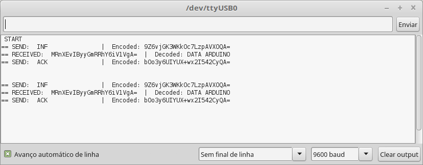

# LoRa_Ra-02_Arduino
Use Ra-02 LoRa module with Arduino 

These examples code is based on RadioHead library so you will need to download the RadioHead library. 
You can do that by visiting the [AirSpayce's Radiohead site](http://www.airspayce.com/mikem/arduino/RadioHead/)
For security reasons it is advisable to use the encrypted versions that use Advanced Encryption Standard (AES).
These examples can be used to communicate with Raspberry Pi through python using examples from this library [rpsreal/pySX127x](https://github.com/rpsreal/pySX127x)

AI-Thinker module Ra-02:
 - Semtech SX1278 low power long range transceiver
 - 433MHz frequency (420 to 450 MHz range)
 - SPI communication
 - Supply Voltage default 3.3V

Arduino boad or compatible
 - This boad is 3,3V level and not 5V so to use Arduino Uno or Arduino Pro Mini 5V you have to use a Bi-Directional Logic Level Converter.

 Note: These examples can be used with the RFM95 module but it is necessary to change the frequency in the files.

# Setup

 Wiring example with Arduino Pro Mini 3,3V 8MHz
# Images need updating	
 
 
 
* 1º Install the [RadioHead library](http://www.airspayce.com/mikem/arduino/RadioHead/) in the Arduino IDE
* *	For the encrypted versions:
* *	1.1º Install the [Base64 library](https://github.com/adamvr/arduino-base64)
* *	1.2º Install the [AESLib library](https://github.com/DavyLandman/AESLib)
* 2º Download and run the LORA_CLIENT to the Arduino IDE or [Raspberry Pi](https://github.com/rpsreal/pySX127x).
* 3º Download and run the LORA_SERVER to the Arduino IDE or [Raspberry Pi](https://github.com/rpsreal/pySX127x).
 
 # Images need updating
 LORA_SERVER_encrypted
  
 LORA_CLIENT_encrypted
  

 
 Developed by Rui Silva, Porto, Portugal
