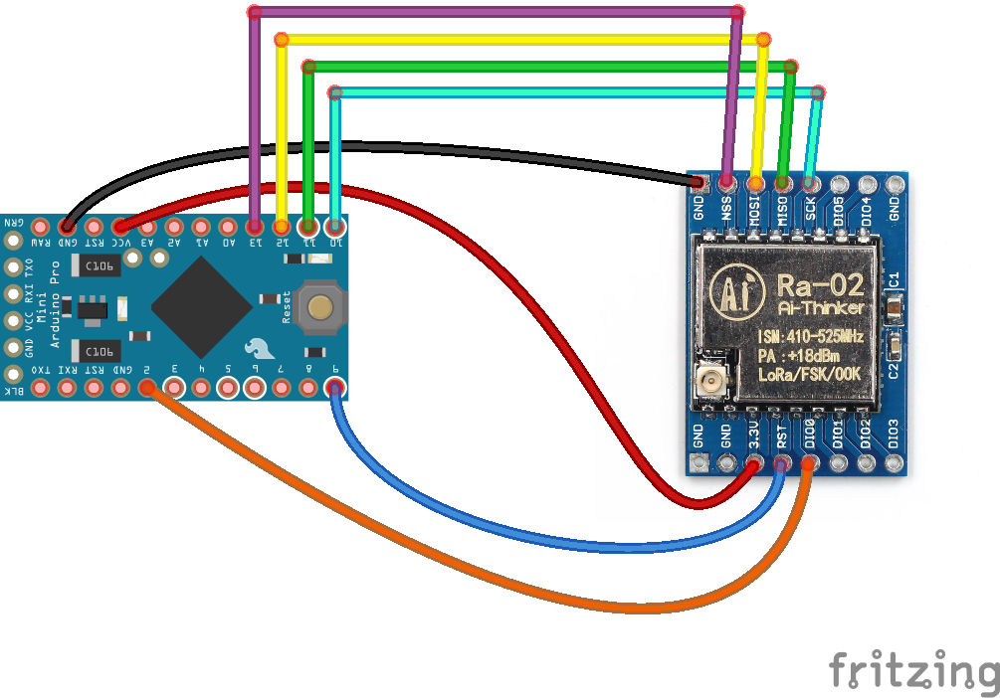
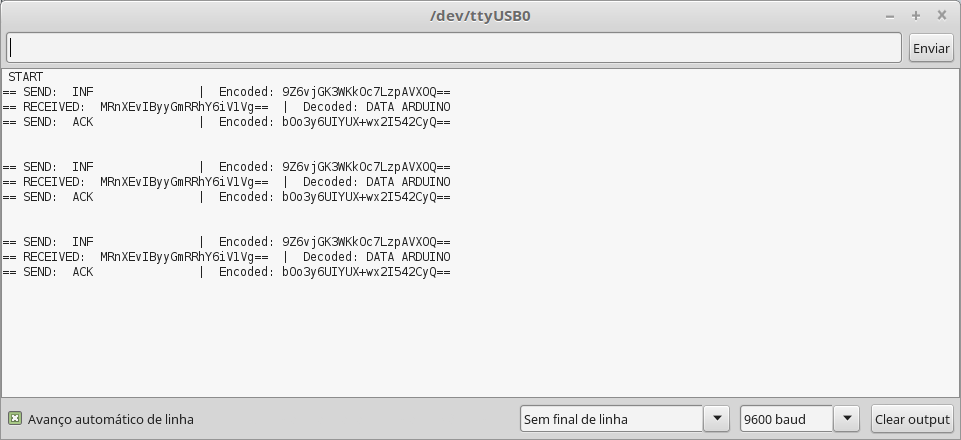
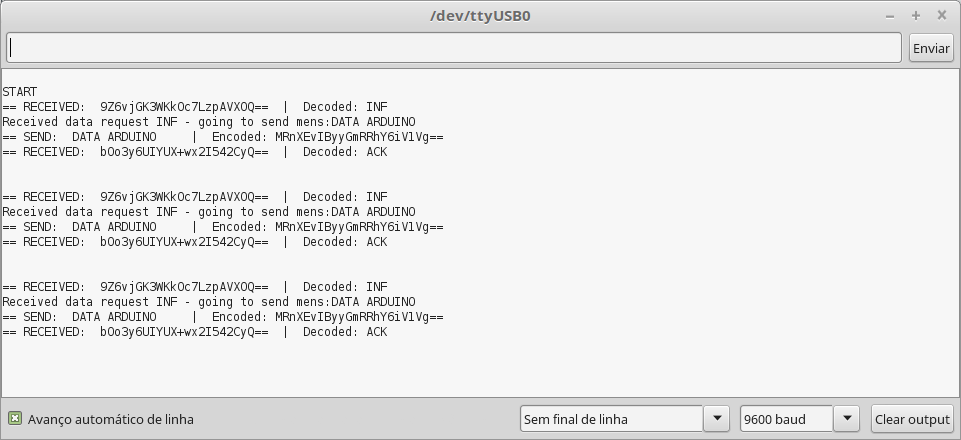

# LoRa_Ra-02_Arduino
These are sample codes for LORA communication for the Arduino. It works with Semtech SX127x, HopeRF RFM9x, Microchip RN2483 long range, low power transceiver families. 

These examples code is based on RadioHead library so you will need to download the RadioHead library. 
You can do that by visiting the [AirSpayce's Radiohead site](http://www.airspayce.com/mikem/arduino/RadioHead/)
For security reasons it is advisable to use the encrypted versions that use Advanced Encryption Standard (AES).
These examples can be used to communicate with Raspberry Pi through python using examples from this library [rpsreal/pySX127x](https://github.com/rpsreal/pySX127x)

 **Note:** These examples can be used with different modules that do not use the 434MHz frequency but it is necessary to change the frequency in the files (#define RF95_FREQ).

# Setup

 Wiring example with Arduino Pro Mini 3,3V 8MHz and AI-Thinker module Ra-02 (Semtech SX1278 433MHz frequency)

 
 
 
* 1º Install the [RadioHead library](http://www.airspayce.com/mikem/arduino/RadioHead/) in the Arduino IDE
* *	For the encrypted versions:
* *	1.1º Install the [Base64 library](https://github.com/adamvr/arduino-base64)
* *	1.2º Install the [AESLib library](https://github.com/DavyLandman/AESLib)
* 2º Download and run the LORA_CLIENT to the Arduino IDE or [Raspberry Pi](https://github.com/rpsreal/pySX127x).
* 3º Download and run the LORA_SERVER to the Arduino IDE or [Raspberry Pi](https://github.com/rpsreal/pySX127x).
 

 LORA_SERVER_encrypted
  
 LORA_CLIENT_encrypted
  

 
 Developed by Rui Silva, Porto, Portugal
